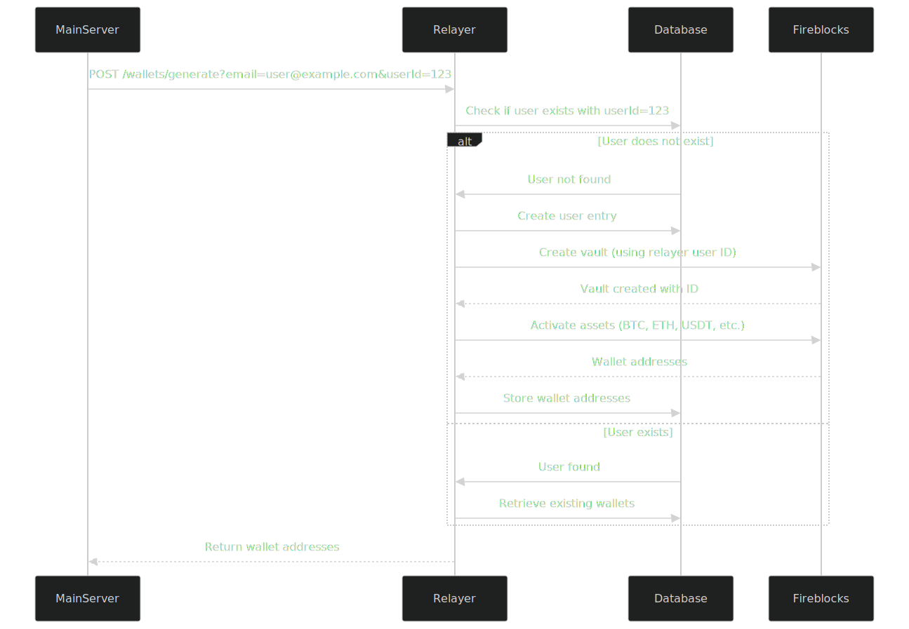

## System Components

1. **Main Server (MonieHub)** - Primary application server
2. **Relayer Service** - Wallet management middleware
3. **Fireblocks** - External secure wallet infrastructure
4. **Database** - Stores user and wallet information


## Workflow

### 1. Wallet Generation Flow
```
Main Server → POST /wallets/generate?email=user@example.com&userId=123
    │
    ↓
Relayer receives request
    │
    ↓
Check if user exists with userId
    │
    ↓
If not exists → Create user entry with email and userId
    │
    ↓
Create Fireblocks vault using the new user ID as reference
    │
    ↓
Activate supported assets (BTC, ETH, USDT, BSC, Solana)
    │
    ↓
Store wallet addresses in database
    │
    ↓
Return wallet addresses to main server
```

### 2. Deposit Handling Flow
```
Fireblocks detects deposit → Sends webhook to relayer
    │
    ↓
Relayer verifies webhook signature
    │
    ↓
Check if address exists in database
    │
    ↓
Update wallet balance
    │
    ↓
Create transaction record
    │
    ↓
(Optional) Notify main server of deposit
```

## Sequence Diagram




## API Endpoints

### 1. Generate Wallet Address
- **Endpoint**: `POST /wallets/generate`
- **Purpose**: Creates new wallet addresses for a user
- **Request Query Parameters**:
  - `email` (string, required): User's email address
  - `userId` (string, required): User's unique identifier from main server
- **Response**:
  ```json
  {
    "success": true,
    "vaultId": "string",
    "wallets": [
      {
        "asset": "BTC",
        "address": "string",
        "balance": 0
      },
        {
        "asset": "USDT",
        "address": "string",
        "balance": 0
      }
    
      
    ]
  }
  ```

### 2. Get User Wallets
- **Endpoint**: `GET /wallets/user/:userId`
- **Purpose**: Retrieve all wallet addresses for a specific user
- **Response**:
  ```json
  {
    "userId": "string",
    "wallets": [
      {
        "id": "string",
        "asset": "BTC",
        "address": "string",
        "balance": 0.5,
        "createdAt": "datetime"
      }
    ]
  }
  ```


  
### 3. Add Asset
- **Endpoint**: `POST /wallet/asset`
- **Purpose**: Retrieve all wallet addresses on the platform (admin only)
- **Query Parameters**:
  - `userId` (string)
  - `assetId` (string): (SOL etc.)
- **Response**:
  ```json
  {
    "status": "success",
    "wallets": [
      {
        "id": "string",
        "asset": "SOL",
        "address": "string",
        "balance": 0,
        "createdAt": "datetime"
      }
    ]
  }

### 4. Get All Wallets (Admin)
- **Endpoint**: `GET /admin/wallets`
- **Purpose**: Retrieve all wallet addresses on the platform (admin only)
- **Query Parameters**:
  - `userId` (string, optional): Filter by user ID
  - `asset` (string, optional): Filter by asset name (BTC, ETH, USDT, etc.)
- **Response**:
  ```json
  {
    "wallets": [
      {
        "id": "string",
        "userId": "string",
        "email": "string",
        "asset": "BTC",
        "address": "string",
        "balance": 0.5,
        "createdAt": "datetime"
      }
    ]
  }
  ```

  ```

### 5. Webhook Endpoint
- **Endpoint**: `POST /webhooks/fireblocks`
- **Purpose**: Receive deposit notifications from Fireblocks
- **Headers**:
  - `X-Fireblocks-Signature`: Signature for verification
- **Request Body** (Fireblocks webhook format):
  ```json
  {
    "type": "VAULT_ACCOUNT_ASSET_ADDRESS_CREATED",
    "data": {
      "vaultAccountId": "string",
      "assetId": "BTC",
      "address": "string"
    }
  }
  ```


## Error Handling

- Invalid requests return 400 status with error message
- Fireblocks integration errors return 502 status
- Database errors return 500 status
- Webhook verification failures return 401 status


