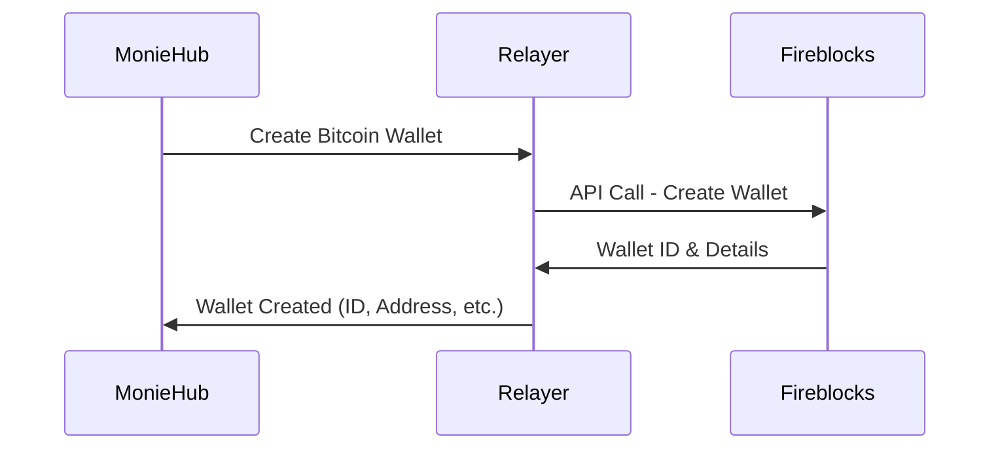

# MonieHub Relayer

## Overview

The **Relayer** is a middleware service that sits between **MonieHub** and **Fireblocks**.
It handles requests from MonieHub (such as creating a new Bitcoin wallet) and securely communicates with Fireblocks to execute those operations.

Once Fireblocks responds, the Relayer sends updates back to MonieHub in a structured format.

This ensures that MonieHub doesn’t have to talk to Fireblocks directly and can instead rely on the Relayer as a secure, simplified gateway.

---

## ✨ Key Responsibilities

* **Wallet Management**

  * Creates and manages wallets (e.g., Bitcoin) on behalf of MonieHub by interacting with Fireblocks.

* **Transaction Relay**

  * Receives requests from MonieHub (e.g., send funds, check balances).
  * Forwards them to Fireblocks securely.
  * Sends back results and updates.

* **Security Layer**

  * Abstracts Fireblocks API keys and credentials away from MonieHub.
  * Ensures sensitive operations are centralized and controlled.

* **Update Syncing with Webhooks**

  * Fireblocks sends events to the relayer.
  * The relayer pushes structured webhooks notifications to MonieHub.
  * Moniehub processes the updates automatically.

---

## 🏗️ How It Works

1. **MonieHub Request**

   * Example: “Create a Bitcoin wallet for user X.”
2. **Relayer Processing**

   * Relayer translates this request into the appropriate Fireblocks API call.
3. **Fireblocks Action**

   * Fireblocks performs the requested action (e.g., creates wallet).
4. **Relayer Response**

   * Relayer sends the result back to MonieHub in a standardized format.

---

## 🚀 Benefits

* **Simplified Integration**: MonieHub only talks to the Relayer, not directly to Fireblocks.
* **Security**: Fireblocks credentials are never exposed to MonieHub.
* **Scalability**: Future integrations (e.g., other custody providers) can plug into the same Relayer layer.

---

## 🔮 Example Use Case

---

## 📝 Notes

* The Relayer currently supports **wallet creation** and **transaction updates**.
* Future versions may include multi-chain support and integrations with other custody solutions.

